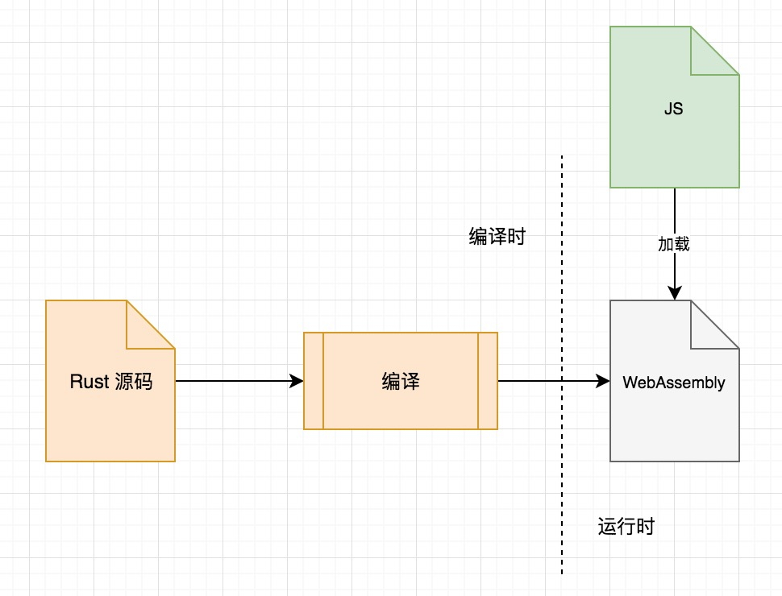
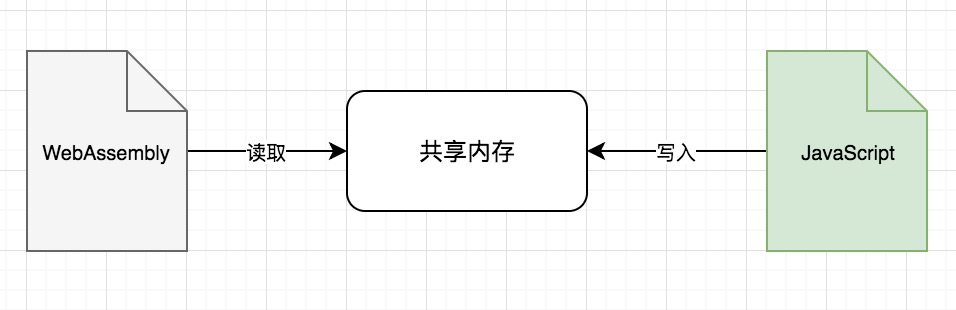

使用 Rust + WebAssembly 编写 crc32 

## 背景

WebAssembly 在最近几年里可以说是如火如荼了。从基于 LLVM 的 [Emscripten](https://github.com/kripken/emscripten) ，到尝试打造全流程工具链的 [binaryen](https://github.com/WebAssembly/binaryen) ，再到 Rust 社区出现的[wasm-bindgen](https://github.com/rustwasm/wasm-bindgen)……现在 webpack 4 已经内置了`wasm`的引入，甚至连 Go 社区也不甘落后地推出了[相关的计划](https://docs.google.com/document/d/131vjr4DH6JFnb-blm_uRdaC0_Nv3OUwjEY5qVCxCup4/preview#heading=h.mjo1bish3xni)。

作为一个普通的前端开发者，我虽然一直在关注它的发展，但始终没有直接操刀使用的机会。直到最近，我们想使用 crc32 算法做一些字符串校验时，我想看看 WebAssembly 是否能够在这项计算任务上，比原生 JavaScript 更具有性能优势。

## 有关 crc32

crc32 算法是一个专门用于 **校验数据** 是否被意外篡改的算法。它在计算量上比md5 、 sha 这类密码学信息摘要算法要小很多，但修改任何一个字节，都会引起校验和发生变化。crc32 并不是密码学安全的，构造两组校验和相同的数据[并不困难](https://github.com/madler/spoof/)。因此，crc32 适合用在意外篡改的检查上，而不适合用在对抗人工篡改的环境下。

在原理上， crc32 可以被看作是使用数据对某个选定的数字（Polynomial，常被缩写为“Poly”，实际是一个生成数字的多项式简写形式），进行某种形式的除法。除法产生的余数，就是校验和。具体的算法原理略微复杂一些，大家可以参考这篇[《无痛理解CRC》](http://www.ross.net/crc/download/crc_v3.txt)。

不同的数字会对算法有很强的影响。在计算机领域，有好几个不同的数字在不同的领域采用。gzip 用的 crc32 的数字，就和 ext4 文件系统用的不同。

历史上， crc32 的算法也被改进过多次。从最简单的逐位计算，到采用查找表进行优化，再到使用多张查找表优化，其性能被提升了数百倍之多。关于这点，大家可以在 [Fast CRC32](http://create.stephan-brumme.com/crc32/) 上查看详情。对于大部分场景，我们追求性能而不是代码体积，因此尽可能利用查找表，能够让算法发挥最强的性能。

要想对比 JS 版和 Rust 版 crc32 的性能差距，首先要排除掉算法实现不同带来的影响。因此，下面我在进行性能对比时所采用的 crc32 算法，都是我自己参考第三方代码来写的，并不直接采用现成的包。

不过由于 crc32 的实现版本太多，这里只挑取其中性能较好同时查找表体积适中的 [Slicing-by-8](http://create.stephan-brumme.com/crc32/#slicing-by-8-overview) 实现来写。

## 用 JavaScript 写一个 crc32

现在我们新建一个`crc32.js`文件，存放我写的 crc32 。这种 crc32 的实现需要进行两个步骤，第一个步骤是生成查找表：

```javascript
// crc32.js
const POLY = 0xedb88320;
const TABLE = makeTable(POLY);
const TABLE8 = (function () {
  const tab = Array(8);
  for (let i = 0; i < 8; i++) {
    tab[i] = new Uint32Array(256);
  }
  tab[0] = makeTable(POLY);
  for (let i = 0; i <= 0xFF; i++) {
    tab[1][i] = (tab[0][i] >>> 8) ^ tab[0][tab[0][i] & 0xFF];
    tab[2][i] = (tab[1][i] >>> 8) ^ tab[0][tab[1][i] & 0xFF];
    tab[3][i] = (tab[2][i] >>> 8) ^ tab[0][tab[2][i] & 0xFF];
    tab[4][i] = (tab[3][i] >>> 8) ^ tab[0][tab[3][i] & 0xFF];
    tab[5][i] = (tab[4][i] >>> 8) ^ tab[0][tab[4][i] & 0xFF];
    tab[6][i] = (tab[5][i] >>> 8) ^ tab[0][tab[5][i] & 0xFF];
    tab[7][i] = (tab[6][i] >>> 8) ^ tab[0][tab[6][i] & 0xFF];
  }
  return tab;
})();

function makeTable(poly) {
  const tab = new Uint32Array(256);
  for (let i = 0; i < 256; i++) {
    let crc = i;
    for (let j = 0; j < 8; j++) {
      if (crc & 1 === 1) {
        crc = (crc >>> 1) ^ poly;
      } else {
        crc >>>= 1;
      }
      tab[i] = crc;
    }
  }
  return tab;
}
```

这个步骤我放在模块全局了，因为查找表只需要生成一次，后面实际进行 crc32 的计算时，只读就可以了。

第二个步骤就是 crc32 本身的计算：

```javascript
// 续crc32.js
// 读取和拼装32位整数
function readU32(buf, offset) {
  return buf[0 + offset] + ((buf[1 + offset]) << 8) + ((buf[2 + offset]) << 16) + ((buf[3 + offset]) << 24);
}

// 实际计算
function crc32(buf) {
  let crc = ~0;
  let leftLength = buf.byteLength;
  let bufPos = 0;
  while (leftLength >= 8) {
    crc ^= readU32(buf, bufPos);
    crc = TABLE8[0][buf[7 + bufPos]] ^
    TABLE8[1][buf[6 + bufPos]] ^
    TABLE8[2][buf[5 + bufPos]] ^
    TABLE8[3][buf[4 + bufPos]] ^
    TABLE8[4][(crc >>> 24) & 0xFF] ^
    TABLE8[5][(crc >>> 16) & 0xFF] ^
    TABLE8[6][(crc >>> 8) & 0xFF] ^
    TABLE8[7][crc & 0xFF];
    bufPos += 8;
    leftLength -= 8;
  }
  for (let byte = 0; byte < leftLength; byte++) {
    crc = TABLE[(crc & 0xFF) ^ buf[byte + bufPos]] ^ (crc >>> 8);
  }
  return ~crc;
}

module.exports = crc32;
```

为方便未来对比，我将这个函数导入并重新命名，然后搭建一个对比测试的环境：

```javascript
// index.js
const Benchmark = require('benchmark');
const crc32ByJs = require('./crc32');
// 导入测试文本数据
const testSource = fs.readFileSync('./fixture/jquery.js.txt', 'utf-8');
const text = testSource;
// 为了屏蔽掉编码带来的性能影响，我预先就将字符串编码
const textInU8 = stringToU8(text);

// 辅助工具函数，帮我们把字符串编码 的二进制数据
function stringToU8(text) {
  return Buffer.from(text, 'utf8');
}
```

注意，这里虽然使用了 UTF-8 ，但其实也可以选择其他的编码，比如 UTF-16 或者 UTF-32，只不过 UTF-8 的支持更加广泛一些，另外不必关心字节序，也更方便于解码。

现在我们可以开始搞 WebAssembly 版的 `crc32ByWasm`了。

## WebAssembly 与 Rust

WebAssembly 本身是非常类似机器码的一种语言，它紧凑且使用二进制来表达，因此在体积上天然有优势。但要让开发者去写机器码，开发成本会非常高，因此伴随着 WebAsssembly 出现的还有相应的人类可读的文本描述—— [S 表达式描述](https://github.com/WebAssembly/spec/tree/master/interpreter#s-expression-syntax)：

```lisp
(module
  (type $type0 (func (param i32 i32) (result i32)))
  (table 0 anyfunc)
  (memory 1)
  (export "memory" memory)
  (export "add" $func0)
  (func $func0 (param $var0 i32) (param $var1 i32) (result i32)
    get_local $var1
    get_local $var0
    i32.add
  )
)
```

S表达式已经比机器码可读性强很多了，但我们能使用的依然是一些非常底层的操作，比较类似汇编语言。因此，目前更常见的玩法，是将其他编程语言编译到 WebAssembly，而不是直接去写 WebAssembly 或者 S 表达式。

Rust 社区在这方面目前进展比较不错，有[专门的工作小组](http://fitzgeraldnick.com/2018/02/27/wasm-domain-working-group.html)来支持这件事。我虽然之前没有太多 Rust 经验，但这次非常想利用社区的工作成果，以避开其他语言生成 WebAssembly 的各种不便。



## 打造 Rust 工具链

Rust 社区和 JavaScript 社区有一些相似，大家都是乐于在工程化上投入精力，并致力于提升开发舒适度的群体。搭建一个 Rust 开发环境其实非常简单，总共只需要3步：

1. 下载并安装 `rustup`。这一步和安装 `nvm` 差不多。
2. 使用 `rustup` 来安装和使用 `nightly` 版的 rust。这一步相当于使用 `nvm` 安装具体的 Node.js 版本
3. 继续使用 `rustup`，下载安装名为 `wasm32-unknown-unknown` 的编译目标。这一步是 `rust` 独有的了，不过实际上任何能交叉编译的编译器，都要来这么一遍。

这里稍微说一下什么叫做“交叉编译”。

正常来讲，如果我在 Linux x86 的系统里安装一套 C++ 编译器，那么当我使用这套编译器生成可执行程序的时候，它生成的就是本机能用的程序。那如果我有一台 Windows 的机器，却没有在其中安装任何编译器，该怎么办呢？这时，如果有一套 C++ 编译器能在 Linux x86 上运行，但产生的代码却是执行在 Windows 上的，这套编译器就是交叉编译工具了。相对应的，这个过程就叫做交叉编译。

如之前所说， WebAssembly 是一种机器码，那么用 Rust 编译器（本来生成的是macOS或者Linux x86的可执行程序）生成它，自然就是一种交叉编译了。

这个过程整理成脚本就是如下的样子了：

```shell
# 执行完这句话以后，和安好nvm一样，要在命令行里引入一下 rustup
curl https://sh.rustup.rs -sSf | sh
rustup toolchain install nightly # 安装 nightly 版 rust
rustup target add wasm32-unknown-unknown # 安装交叉编译目标
```

*注意，不同的平台上的Rust安装过程可能略有差异，届时需要根据具体情况来做调整。明确自己所用的 Rust 版本非常重要，因为 Rust 对 WebAssembly 的支持还在早期阶段，一些工程化的代码随时可能发生变化。在写这篇文章时，我所用的 Rust 版本为 rustc 1.28.0-nightly (2a1c4eec4 2018-06-25)。*

## 创建一个 Rust 项目

安装好 Rust 之后，会自带一个名为 cargo 的命令行。cargo 是 Rust 社区的包管理命令行工具，比较类似于 Node.js 社区的 npm 。创建 Rust 项目可以直接使用 cargo 进行：

```shell
cargo new crc32-example
```

这样我们就可以在当前目录下创建一个新目录 `crc32-example`，并在其中初始化好了我们的代码。cargo 默认会新建两个文件，分别是 `Cargo.toml` 和 `lib.rs`（具体代码可参见文末的源码），他们的作用分别是：

- `Cargo.toml`相当于是 Rust 社区的 `package.json`，用于存放依赖描述和一些项目元信息。
- `lib.rs`是代码的入口文件，以后我们写的 Rust 代码就会放在其中。

下面我们会详细说说 WebAssembly 的调用。

## Node.js 调用 WebAssembly

Node.js 不同的版本对 WebAssembly 支持各不相同，在我自己的测试中发现，Node.js 8.x的支持就算是比较稳定了，因此后面我都会用 Node.js 8.x 来写。

WebAssembly 在 JavaScript 中如何调用的文章在网上比较多了，大家可以自己搜索参考一下，这里我只列出一些核心，不做具体的介绍了。

WebAssembly 在 JavaScript 当中可以被看作是一种特殊“模块” ，这个模块对外导出若干函数，同时也能接受 JavaScript 向其中导入函数。由于 JavaScript 自己的内存管理是通过垃圾回收器来自动做的，而其他一些静态语言通常是开发者手动管理内存，WebAssembly 当中所用的内存，需要从普通的 JavaScript 内存中区分开来，单独开辟和管理。

在使用 WebAssembly 时，首先要对其进行初始化。初始化的时候，JavaScript 引擎会校验 WebAssembly 的合法性，并将单独开辟内存、导入函数，和模块进行关联。 这个过程变成代码的话，就是如下的样子：

```javascript
// 续index.js
const wasmFile = fs.readFileSync('./target/wasm32-unknown-unknown/release/wasm_crc32_example.wasm');

const wasmValues = await WebAssembly.instantiate(wasmFile, {
  env: {
    memoryBase: 0,
    tableBase: 0,
    // 单独开辟的内存
    memory: new WebAssembly.Memory({
      initial: 0,
      maximum: 65536,
    }),
    table: new WebAssembly.Table({
      initial: 0,
      maximum: 0,
      element: 'anyfunc',
    }),
    // 导入函数，如果要在 Rust 当中使用任何 JavaScript 函数，都要像这样导入
    logInt: (num) => {
      console.log('logInt: ', num);
    },
  },
});
```

`WebAssembly.instantiate` 将返回一个 `Promise` 对象，对象内部我们关心的是`instance`  属性，它就是初始化后可用的 WebAssembly 对象了：

```javascript
// 续index.js
const wasmInstance = wasmValues.instance;

const {
  // 将 WebAssembly 导出的函数 crc32 重命名为 crc32ByWasm
  // 因为我们已经有一个 JavaScript 的实现，以防混淆
  crc32: crc32ByWasm,
} = wasmInstance.exports;

const text = testSource;
const checksum = crc32ByWasm(text);
```

上面的代码尝试使用 WebAssembly 导出的函数，来计测试文本的校验和。

然而，这种代码其实是行不通的。最大的问题在于，**WebAssembly 是没有真正的字符串类型的**。

WebAssembly 在当前的设计中，能够使用类型其实只有各种类型的数字，从8位整数到64位整数都有。但这里面没有布尔值，也没有字符串等相对比较有争议的类型。

因此，在 JavaScript 和 WebAssembly 之间传递字符串，要靠开辟出的内存来进行辅助传递。



有 C 编程基础的同学可能这里会比较容易理解，这个字符串的传递，其实就是把 JavaScript 中的字符串，编码为 UTF-8 ，然后逐字节复制到内存当中：

```javascript
// 续index.js
function copyToMemory(textInU8, memory, offset) {
  const byteLength = textInU8.byteLength;

  const view = new Uint8Array(memory.buffer);
  for (let i = 0; i < byteLength; i++) {
    view[i + offset] = textInU8[i];
  }
  return byteLength;
}
```

实际在使用内存块时，往往需要更加精细的内存管理，以便同一块内存块可以尽可能地多次使用而又不破坏先前的数据。

上面的`memory`来自`wasmInstance.exports`，所以我们的代码需要稍微调整一下了：

```javascript
// 续index.js
const {
  // 注意这里需要导出的 memory
  memory,
	crc32: crc32ByWasm,
} = wasmInstance.exports;

const text = "testSource";
const textInU8 = stringToU8(text);
const offset = 10 * 1024;
const byteLength = copyToMemory(textInU8, memory, offset);
crc32ByWasm(offset, byteLength);
```

注意`crc32ByWasm`的第一个参数，这个参数所代表的含义是字符串数据在内存块的偏移量。

*在进行测试时，我发现内存块的开头有时会出现其他数据，因此这里我偏移了 10KB ，以防和这些数据发生冲突。我没有深究，但我觉得这些数据很有可能是 WebAssembly 机器码附带的数据，比如查找表。*

## 用 Rust 写一个 crc32

Rust 社区有自己的包管理工具，同时也有自己的依赖托管网站，我在其中找到了[crc32](https://github.com/mrhooray/crc-rs)这个模块。但如同前面所说，我们希望这次做性能测试的时候，能够排除算法实现差异带来的影响，因此 Rust 版的 crc32 我没有直接使用它，而是自己从[rust-snappy](https://github.com/BurntSushi/rust-snappy/blob/master/src/crc32.rs) 里复制出来了一份相似的实现，然后稍微做了些改动。

算法的实现和 JavaScript 差不多，因此不详细贴在这里了，唯独这个实现的导出，可能大家会有些不解，因此我下面稍作一些解释，剩下的大家看文末的源码就可以了：

```rust
// no_mangle 标记会告知编译器，crc32 这个函数的名字和参数不要进行改动
// 因为我们要保持这个函数的接口对 WebAssembly 可用
#[no_mangle]
pub extern fn crc32(ptr: *mut u8, length: u32) -> u32 {
  // std::slice::from_raw_parts 对于编译器来说会产生不可知的后果，这里需要 unsafe 来去除编译器的报错
	unsafe {
		// 将我们传递进来的偏移量和长度，转化为 Rust 当中的数组类型
		let buf : &[u8] = std::slice::from_raw_parts(ptr, length as usize);
    return crc32_internal(buf);
  }
}
```

每一行的含义基本都写在注释里了，这里面唯一比较难理解概念，大概是`unsafe` 了。 

Rust 这门语言的设计哲学当中包含一项“内存安全”。也就是说，使用 Rust 写出的代码 ，都应该不会引发内存使用上带来的问题。Rust 做到这一点，靠的是编译器的静态分析，这就要求所有内存使用，在编译时就确定下来。但是在我们的代码当中，我们需要使用 WebAssembly 当中的内存块，而内存块的实际情况，是在运行时才真正能够确定的。 

这种矛盾就体现在我们需要 Rust 信任我们传递过来的“偏移量”上。因此这段代码需要被标记为 `unsafe`，以便让编译器充分地信任我们所写的代码。

## Benchmark 与性能调优

好了，现在 WebAssembly 版的代码和 JavaScript 版的代码都有了，我想看看他们谁跑的更快一些，所以弄了个简单的 benchmark ：

```javascript
// 续index.js
const suite = new Benchmark.Suite;
const offset = 10 * 1024;
const byteLength = copyToMemory(textInU8, memory, offset);

suite
  .add('crc32ByWasm', function () {
    crc32ByWasm(offset, byteLength);
  })
  .add('crc32ByJs', function () {
    crc32ByJs(textInU8);
  })
  .on('cycle', function (event) {
    console.log(String(event.target));
  })
  .on('complete', function () {
    console.log('Fastest is ' + this.filter('fastest').map('name'));
  })
  .run({
  	'async': true
});
```

是骡子是马拉出来溜溜了！

```
crc32ByJs x 22,444 ops/sec ±1.20% (83 runs sampled)
crc32ByWasm x 37,590 ops/sec ±0.90% (89 runs sampled)
Fastest is crc32ByWasm
```

太好了，性能有67%的提升。现在我们可以证明 WebAssembly 版的 crc32 确实比 JavaScript 版的快了。

但这里还有一个问题被忽略了，那就是如果我们要使用 WebAssembly 版的 crc32 ，我们就不得不将其复制到 WebAssembly 的内存块中；而如果我们使用 JavaScript 版本的就不必这样。于是，我又重新做了一次性能测试，这次我在测试中充分考虑了内存复制：

```
crc32ByJs x 21,383 ops/sec ±2.36% (80 runs sampled)
crc32ByWasm x 34,938 ops/sec ±0.86% (84 runs sampled)
crc32ByWasm (copy) x 16,957 ops/sec ±1.74% (79 runs sampled)
Fastest is crc32ByWasm
```

可以看出，增加了内存复制和编码之后，WebAssembly 版本的性能跌落非常明显，和 JavaScript 相比已经没有优势了。不过这是 Node.js 当中的情况，浏览器中会不会有什么不同呢？于是我尝试了一下在浏览器中进行测试。

## 在浏览器中尝试 WebAssembly

除了IE，其他比较先进的浏览器都已经支持了 WebAssembly。这里我就使用 Chrome 67 来进尝试。

这里，浏览器和 Node.js 环境差别不大，只是字符串的编码，没有 `Buffer` 帮我们去做了，我们需要调用 API 来进行：

```javascript
function stringToU8(text) {
  const encoder = new TextEncoder();
  return encoder.encode(text);
}
```

Webpack 4虽然已经支持了 WebAssembly ，但为了能够自定义初始化 WebAssembly 模块，我还是采用了单独的`arraybuffer-loader` 来加载 WebAssembly 模块。具体的配置和代码可以参考我的源码。

测试结果是，JavaScript 版的 crc32 更慢了， JavaScript 版的实现虽然看起来比带内存复制的 WebAssembly 版更快，但优势不明显：

```
crc32ByJs x 10,801 ops/sec ±1.28% (52 runs sampled)
crc32ByWasm x 28,142 ops/sec ±1.13% (51 runs sampled)
crc32ByWasm (copy) x 11,604 ops/sec ±1.16% (54 runs sampled)
Fastest is crc32ByWasm
```

考虑到实际在业务中使用时，几乎总是要进行内存复制的，WebAssembly 版本的 crc32 即使在计算上有优势，也会被内存问题给掩盖，实用性大打折扣。

*在某些情况下 Webpack 4 自带的 uglify 会产出带有语法错误的文件，因此在实际测试时我关掉了 uglify 。*

## 优化尺寸

执行性能上的对比暂时告一段落了，但我们前端工程师除了关注执行性能外，还关注模块的实际体积。

在 webpack 打包时，我刻意留意了 WebAssembly 相关文件的打包，结果令人大跌眼镜：

```
webpack v4.12.0

6d1b9c1ec10ef7b04017
  size     name  module                                                           status
  489 B    0     (webpack)/buildin/global.js                                      built
  32.4 kB  1     ./fixture/jquery.js.txt                                          built
  879 kB   2     ./target/wasm32-unknown-unknown/release/wasm_crc32_example.wasm  built
  1.8 kB   8     ./crc32.js                                                       built
  497 B    10    (webpack)/buildin/module.js                                      built
  2.25 kB  12    ./browser.js                                                     built

  size     name  asset                                                            status
  1.03 MB  main  app.js                                                           emitted

  Δt 3837ms (7 modules hidden)
```

结果中， `wasm_crc32_example.wasm` 占据了令人惊讶的 `879 kB`。而 `crc32.js` 只占 `1.8 kB`。

说好的更紧凑的二进制呢！区区一个 crc32 怎么会这么大呢？顺着社区的指引，我开始使用 [wasm-gc](https://github.com/alexcrichton/wasm-gc) 来尝试优化体积。

使用之后的情况：

```
webpack v4.12.0

0f45cfd553d632ac59ce
  size     name  module                                                           status
  489 B    0     (webpack)/buildin/global.js                                      built
  32.4 kB  1     ./fixture/jquery.js.txt                                          built
  313 kB   2     ./target/wasm32-unknown-unknown/release/wasm_crc32_example.wasm  built
  1.8 kB   8     ./crc32.js                                                       built
  497 B    10    (webpack)/buildin/module.js                                      built
  2.25 kB  12    ./browser.js                                                     built

  size     name  asset                                                            status
  459 kB   main  app.js                                                           emitted

  Δt 3376ms (7 modules hidden)
```

`wasm_crc32_example.wasm` 的体积被缩减到了 `313 kB`。但我还是觉得不够满意——我明明也就写了几十行代码而已。为此我借助 [twiggy](https://github.com/rustwasm/twiggy) 检查了生成的 wasm 文件包含什么：

```
Shallow Bytes │ Shallow % │ Item
───────────────┼───────────┼──────────────────────────────────────────────────────────────────────────────
        227783 ┊    34.62% ┊ "function names" subsection
        87802 ┊    13.34% ┊ data[0]
        21853 ┊     3.32% ┊ data[1]
          4161 ┊     0.63% ┊ core::num::flt2dec::strategy::dragon::format_shortest::hf5755820aea88984
          3471 ┊     0.53% ┊ core::num::flt2dec::strategy::dragon::format_exact::hc11617164ea3324a
          3466 ┊     0.53% ┊ dlmalloc::dlmalloc::Dlmalloc::malloc::hc22818825fdee93b
          2325 ┊     0.35% ┊ core::num::flt2dec::strategy::grisu::format_shortest_opt::he434a538cbbb5c09
          2247 ┊     0.34% ┊ <std::net::ip::Ipv6Addr as core::fmt::Display>::fmt::hee517e812c10fa59
```

*注意，分析结果已经过精简。实际分析结果非常冗长，这里只截取了最有助于判断的部分。*

从分析结果里可以看出，尺寸占比最大的是函数名。另外，大量我们没有使用到的函数，也在文件当中包含了。比如 `std::net::ip::Ipv6Addr` ，我们根本没用到。

为什么会这样呢？最大的问题在于我们引入了 `std` 这个 “包装箱”（英文为 crate，Rust 社区对包的称呼）。

引入 `std` 的原因主要在两方面。

首先，在初始化 crc32 查找表时，代码采用了 `lazy_static` 这个包装箱提供的功能，它能够初始化一些比较复杂的变量——比如我们的查找表。但其实查找表是固定的，我完全可以写成纯静态的。这个 `lazy_static` 是从 rust-snappy 里复制的，现在可以我干掉它，自己在源码中直接写出构造好的查找表。

其次，我们代码里使用了 `std::slice::from_raw_parts` 这个来自 `std` 的方法，来把指针转换为数组。对于我这个 Rust 新手来说，这个就有些懵了。为此，我专门在 [StackOverflow 上求解了一番](https://stackoverflow.com/questions/50941427/casting-mut-u8-to-u8-without-std?noredirect=1#comment88895130_50941427)，换用 `core::slice::from_raw_parts` 来进行转换。

这样，我们就可以摆脱掉 `std` 了：

*实际摆脱掉 `std` 需要多做一些其他事情，大家可以在源码的`src/lib-shrinked.rs`文件中详细查看。缩减 Rust 编译结果的体积是一个比较繁琐的话题，且根据 Rust 版本不同而不同，具体大家可以参考[官方的指南](https://doc.rust-lang.org/1.14.0/book/no-stdlib.html)。*

```
webpack v4.12.0

8af21121a96f83596bfa
  size     name  module                                                           status
  489 B    0     (webpack)/buildin/global.js                                      built
  32.4 kB  1     ./fixture/jquery.js.txt                                          built
  13.2 kB  2     ./target/wasm32-unknown-unknown/release/wasm_crc32_example.wasm  built
  1.8 kB   8     ./crc32.js                                                       built
  497 B    10    (webpack)/buildin/module.js                                      built
  2.25 kB  12    ./browser.js                                                     built

  size     name  asset                                                            status
  160 kB   main  app.js                                                           emitted

  Δt 3317ms (7 modules hidden)
```

不错，现在 `wasm_crc32_example.wasm` 只占 `13.2 KB` 了。这 `13.2 KB` 还能不能缩呢？其实还是能缩的，但再缩下去需要牺牲一些性能了。原因是我们静态的查找表一共需要 `9 * 256` 项数据，每项数据占 4 字节，因此查找表本身就占去了 `9 KB`。大家可以去 `./target/wasm32-unknown-unknown/release/` 目录下看看，其实真正 `wasm` 当中的代码实际只有约 `1KB` ，但由于 `webpack` 在打包二进制数据时使用了 base64 编码，因此整个文件的尺寸发生了膨胀。

如果还想把查找表也去掉的话，就必须要在运行时动态生成查找表，性能必定会有一些牺牲。 JavaScript 版本的 crc32 查找表就是动态生成的，如果我把它硬编码出来，它其实也是这么大。

在我们之前的性能测试中，我们没有将查找表的生成时间计入，因此还算公平。

## 总结

WebAssembly 虽然在计算时性能优异，但其实在实际使用中困难重重，有一些门槛可以跨过，而有一些则需要等待标准进一步演化和解决。下面总结了几个 Rust + WebAssembly 的坑：

- WebAssembly 只支持整数和浮点数，其他高级类型需要自己序列化和反序列化，这个过程可能会非常耗时，甚至成为性能瓶颈
- WebAssembly 的内存独立，除了内存复制之外，没有其他共享 JavaScript 一侧内存的方案
- WebAssembly 的内存块是分页的，一页内存块64KB，需要处理更多内容时，要么对内容进行拆分，要么扩容内存块，这样代码可能会更加复杂
- Rust 编译出的 WebAssembly 机器码通常因为 `std` 模块的参与而变得体积庞大，替换掉 `std` 是可能的，但需要花很多心思
  - 如果不加任何处理，编译出的 WebAssembly 模块有 600KB 多
  - 通过各种策略，我能够将代码缩减到13.2 KB，这里面有 9KB 是 crc32 算法所需要的表
  - 排除查找表所占体积，实际 WebAssembly 机器码所占体积会比 JavaScript 略小，但经过 base64 编码后会发生膨胀，在我的例子里和 JavaScript 相比优势不明显
- WebAssembly 机器码在调试上目前还无法和 JavaScript 代码并肩，调试比较困难
- WebAssembly 目前只在部分浏览器版本中支持，日常使用仍然需要编写 JavaScript 版本的代码进行降级
- 尽管 WebAssembly 已经非常接近汇编机器码，但一些 CPU 高级指令并不在 WebAssembly 当中包含，而这些指令往往对性能有巨大提升
  - 例如 SIMD 、CRC32 等（对，有些 CPU 直接实现了 crc32）

当然，如果这些对你来说都不是问题，那么 WebAssembly 依然可以一战。但是就我目前的观察来看， WebAssembly 离日常开发还有很多路要走，希望它越变越好。

最后附上已经上传至 Github 的[源码链接](https://github.com/liuyanghejerry/wasm-crc32-example)，大家可以在其中探索。如果有错漏之处，也欢迎开 Issues 给我，多谢了。

## 后续补遗

在本文成文之后，[我和 Rust 社区的大佬们沟通](https://internals.rust-lang.org/t/full-std-crate-is-linked-accidentally-in-wasm-binary/7847)后发现如果在 Rust 中启用 LTO （链接时优化，一种优化技术），则会在编译时自动移除大量 `std` 的内容，从而使最终的 wasm 文件体积显著减小。

根据测算，如果不手动移除 `std` 依赖，生成的 wasm 文件大约 30KB ；手动移除后，是否启用 LTO 没有明显变化。

未来在 Rust [编译 WebAssembly 文件时启用 LLD （LLVM提供的链接器）](https://github.com/rust-lang/rust/pull/48125#issuecomment-364679159)之后， wasm 文件体积会自动变小，不再需要大家操心。